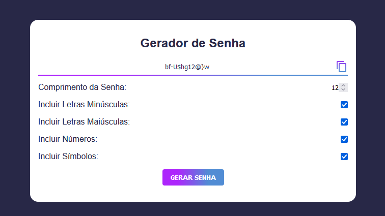

<h1>Gerador de Senha</h1>

Gerador de senha desenvolvido utilizando HTML, CSS e JavaScript.

 

<h3>Funcionalidades</h3>

- Gera senhas aleatórias com diferentes comprimentos e níveis de complexidade.
- Permite personalizar a senha de acordo com suas preferências.

 

<h3>Como Usar</h3>

- Clone este repositório ou faça o download do arquivo ZIP.
- Abra o arquivo index.html em qualquer navegador web moderno.

 

<h3>Licença</h3>

Este projeto está licenciado sob a Licença MIT - consulte o arquivo [LICENSE](LICENSE) para obter detalhes.